# Breast Cancer AI Project - Client Report

## 1. Executive Summary

تم تنظيم المشروع في شكل نظام واحد لتحليل سرطان الثدي باستخدام بيانات الجينات والبيانات الإكلينيكية. النظام يغطي:

- Cancer molecular signature prediction من TCGA-BRCA.
- Future breast cancer incidence risk من BCSC كنموذج منفصل للتنبؤ بنسبة احتمالية الإصابة خلال سنة.
- Tumor subtype prediction باستخدام labels حقيقية من METABRIC وليس proxy labels.
- Prognosis prediction للـ survival و recurrence باستخدام METABRIC.
- External validation على GEO datasets.
- Gene correlation and expression pattern analysis لتوضيح العلاقات بين الجينات.
- Streamlit demo يسمح للعميل بتجربة نموذج BCSC، استعراض نتائج المرضى، وتجربة علاقات الجينات.

## 2. Project Scope

الهدف النهائي ليس فقط اكتشاف Cancer / Normal، لكن بناء framework بحثي شامل:

- تحديد هل العينة cancer-like أم normal-like.
- تحديد subtype للورم.
- تقدير risk/prognosis للـ survival و recurrence.
- تقدير future incidence risk كنسبة مئوية من بيانات BCSC.
- تفسير أهم الجينات والعلاقات بينها.
- تقديم clinical support insights للدكتور بدون ادعاء علاج مباشر.

## 3. Results Overview

| Part | Dataset | Target | Samples | Main metric | Status |
| --- | --- | --- | --- | --- | --- |
| Cancer molecular signature | TCGA-BRCA | Cancer vs Normal tissue | 1224 | Holdout ROC-AUC 1.000, Accuracy 1.000 | Completed |
| Future incidence risk | BCSC | 1-year breast cancer diagnosis risk | 2392998 | Validation ROC-AUC 0.639 | Completed |
| Tumor subtype | METABRIC | Real CLAUDIN molecular subtype | 1980 | Holdout balanced accuracy 0.748 | Completed |
| Survival prognosis | METABRIC | Overall survival event risk | 1980 | Holdout ROC-AUC 0.750 | Completed |
| Recurrence prognosis | METABRIC | Recurrence-free survival event risk | 1979 | Holdout ROC-AUC 0.657 | Completed |
| External validation | GEO: GSE2034, GSE20685, GSE7390 | Relapse, metastasis, death, RFS, OS | 1643 | External ROC-AUC range 0.348 to 0.664 | Completed with limitations |
| Gene correlation and patterns | METABRIC | Gene-gene correlation and expression patterns | 1980 | 232 strong gene pairs | Completed |

## 4. Key Numbers

### TCGA Cancer Molecular Signature

- Samples: 1224
- Features: 18936
- Holdout ROC-AUC: 1.000
- Holdout accuracy: 1.000
- Balanced accuracy: 1.000
- Important caveat: هذه نتيجة Cancer vs Normal tissue signature، وليست future incidence risk لشخص سليم.

**TCGA Cancer Signature ROC Curve**

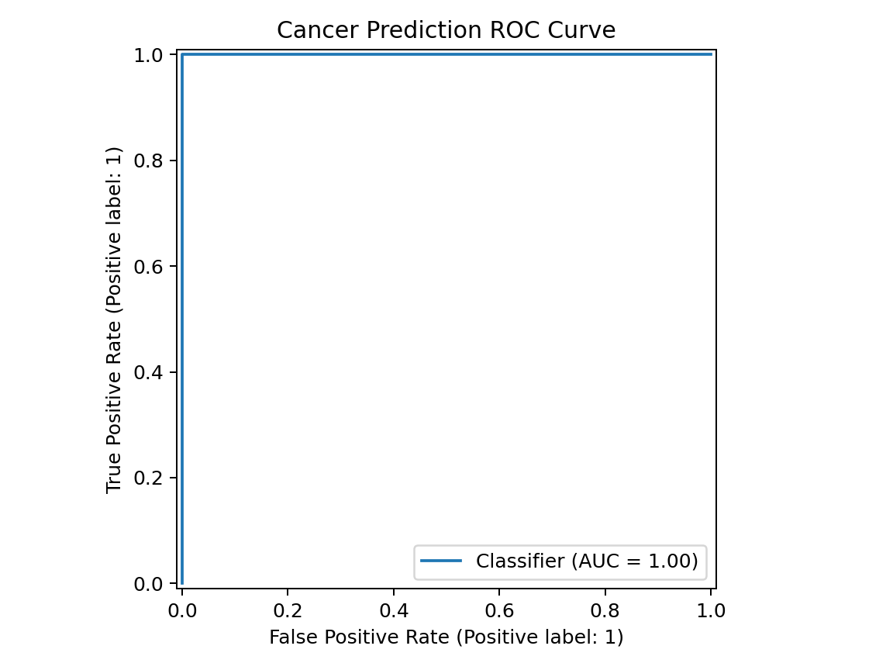

**TCGA Cancer Signature Confusion Matrix**

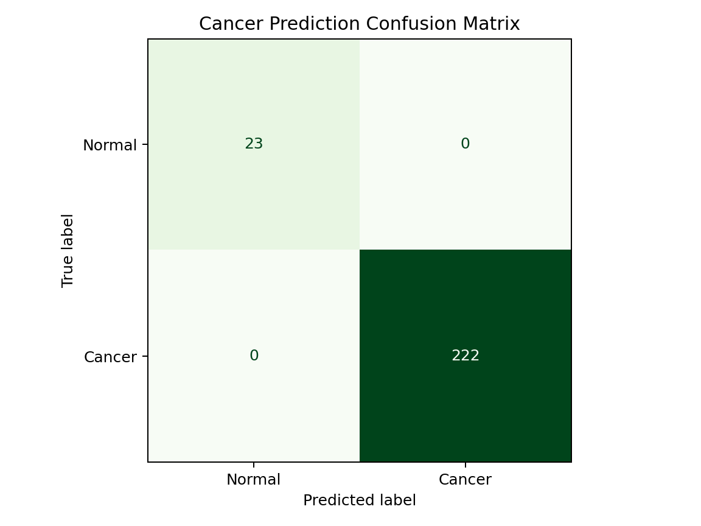

**TCGA Top Cancer Signature Genes**

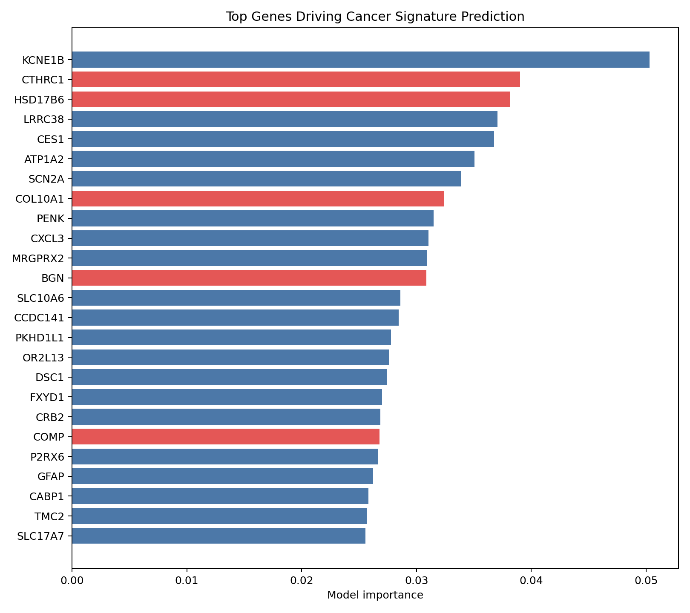

### BCSC Future Incidence Risk

- Task: Future breast cancer incidence risk after screening mammogram
- Horizon: 1 year after index screening mammogram
- Weighted training records: 1795139
- Weighted validation records: 597859
- Validation ROC-AUC: 0.639
- Brier score: 0.00477
- Important caveat: هذا النموذج يتوقع احتمالية تشخيص سرطان الثدي خلال سنة بعد screening mammogram، وليس مبنيًا على gene expression.

**BCSC Future Risk ROC Curve**

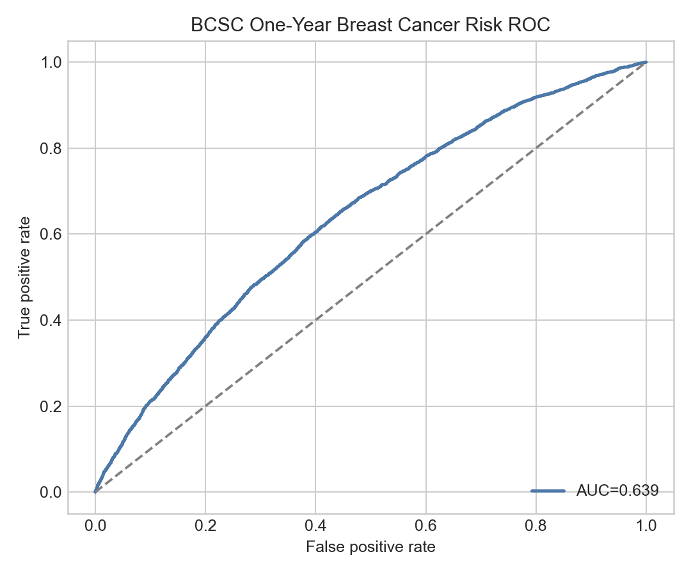

**BCSC Calibration**

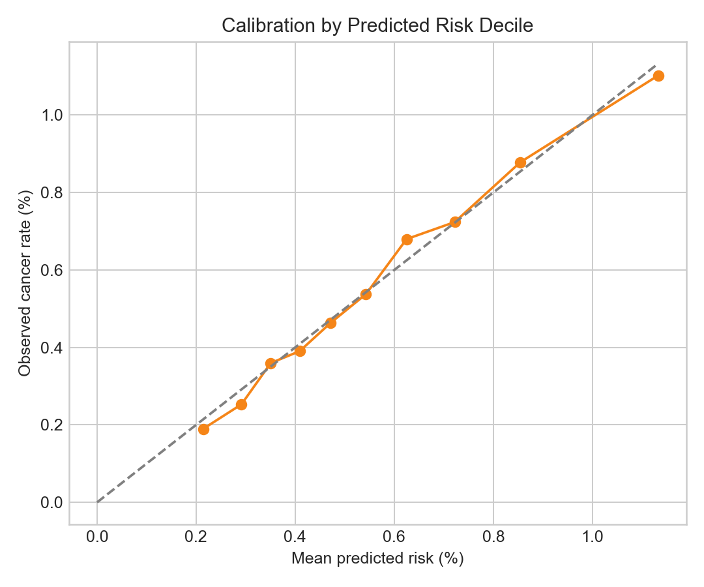

**BCSC Top Risk Feature Effects**

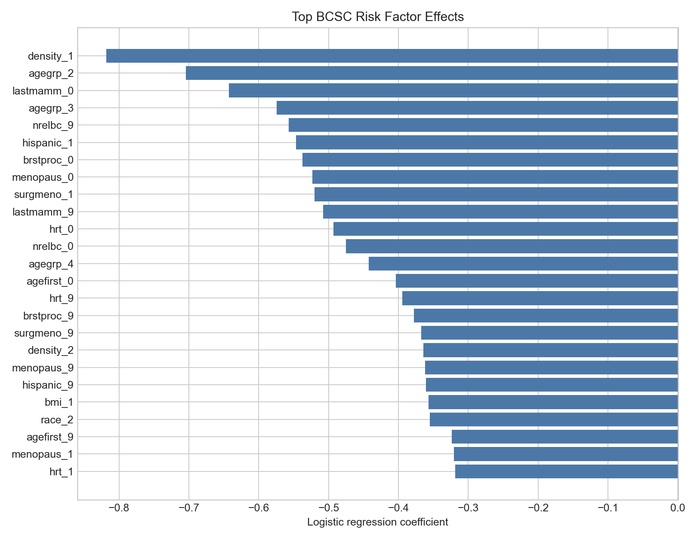

### Tumor Subtype Prediction

- Dataset: METABRIC
- Label source: CLAUDIN_SUBTYPE
- Samples predicted: 1980
- Real labeled samples: 1974
- Classes: Basal, Her2, LumA, LumB, Normal, claudin-low
- Honest holdout accuracy: 0.762
- Honest holdout balanced accuracy: 0.748

**Tumor Subtype Confusion Matrix**

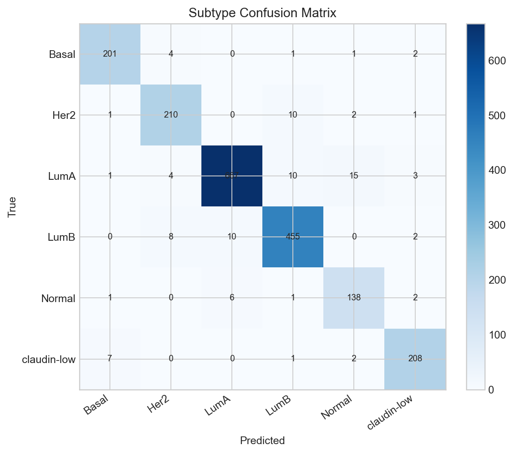

**Predicted Tumor Subtype Distribution**

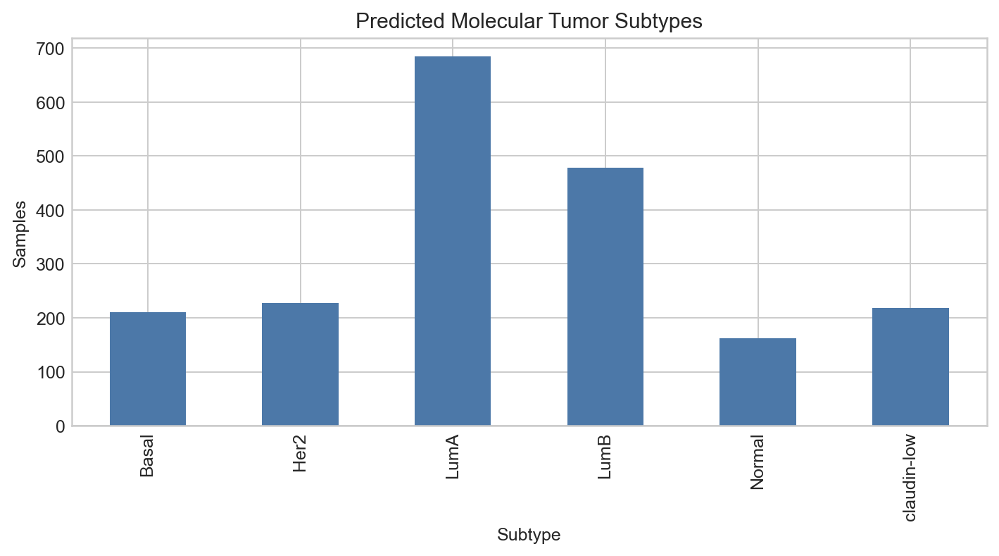

**Top Subtype Genes**

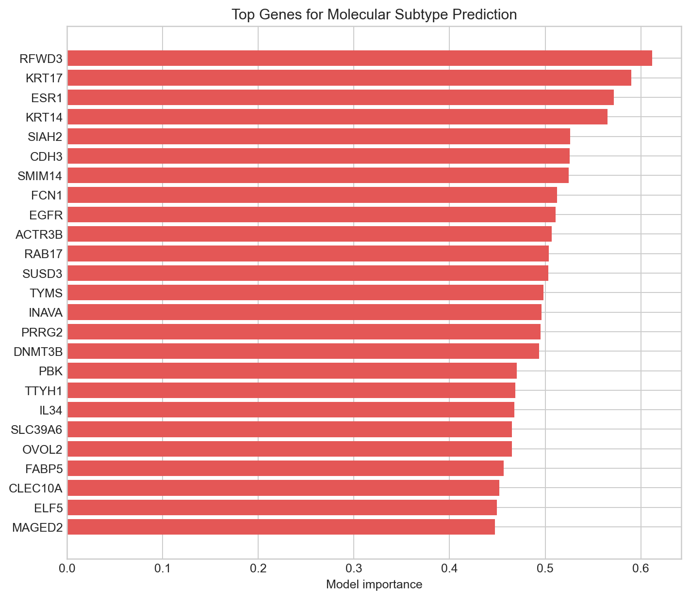

### METABRIC Prognosis

Survival endpoint:

- Best model: combined_logreg_k50
- Samples: 1980
- Events: 1143
- CV ROC-AUC: 0.742
- Holdout ROC-AUC: 0.750
- Holdout balanced accuracy: 0.680

Recurrence endpoint:

- Best model: combined_rf_k100
- Samples: 1979
- Events: 803
- CV ROC-AUC: 0.675
- Holdout ROC-AUC: 0.657
- Holdout balanced accuracy: 0.605

**Optimized Prognosis Performance**

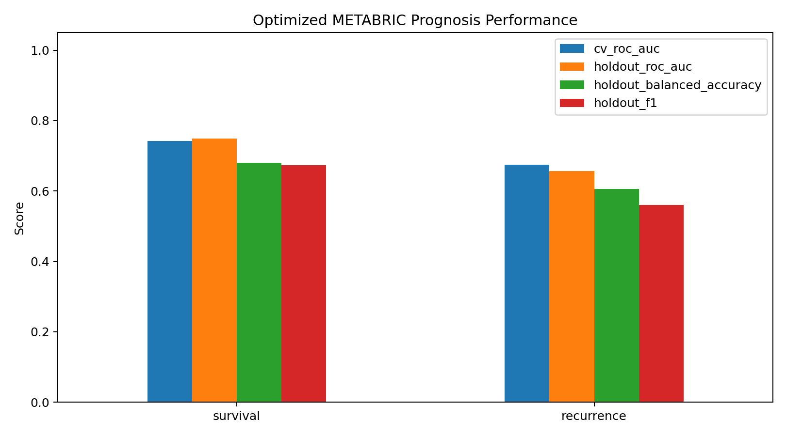

**METABRIC Holdout ROC Curves**

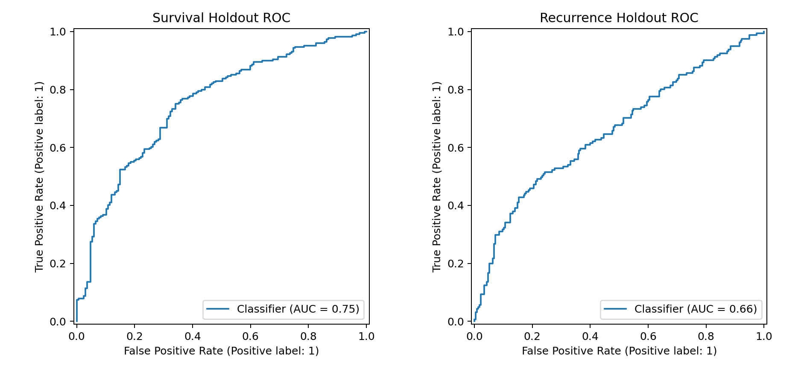

**Kaplan Meier Risk Groups**

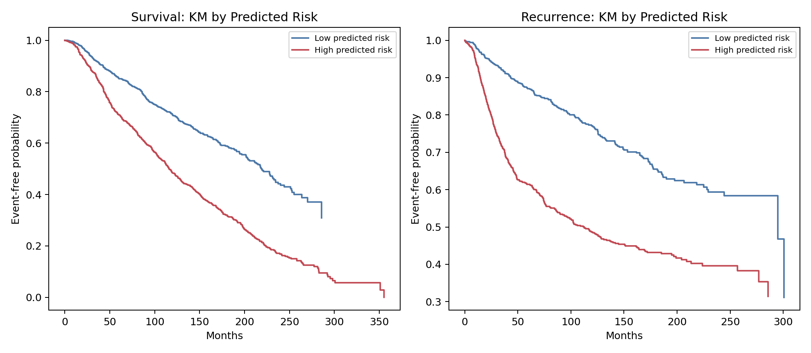

### GEO External Validation

| label_name | dataset | endpoint | samples | events | overlap_genes_used | roc_auc | balanced_accuracy | f1 |
| --- | --- | --- | --- | --- | --- | --- | --- | --- |
| GSE20685_metastasis | GSE20685 | metastasis | 327 | 83 | 48 | 0.6635887813549279 | 0.5851767726644281 | 0.4285714285714285 |
| GSE20685_death | GSE20685 | overall_survival | 327 | 83 | 86 | 0.6309500296267035 | 0.5730051352952794 | 0.417910447761194 |
| GSE2034_relapse | GSE2034 | relapse | 286 | 107 | 42 | 0.6261682242990654 | 0.5897770584242678 | 0.5467625899280576 |
| GSE20685_regional_relapse | GSE20685 | regional_relapse | 307 | 25 | 48 | 0.5639716312056737 | 0.5234042553191489 | 0.1530612244897959 |
| GSE7390_rfs | GSE7390 | recurrence_free_survival | 198 | 91 | 42 | 0.5510937660470371 | 0.5328129814111122 | 0.5480769230769231 |
| GSE7390_os | GSE7390 | overall_survival | 198 | 142 | 68 | 0.3479627766599598 | 0.4015342052313883 | 0.5868725868725869 |

**METABRIC to GEO External AUC**

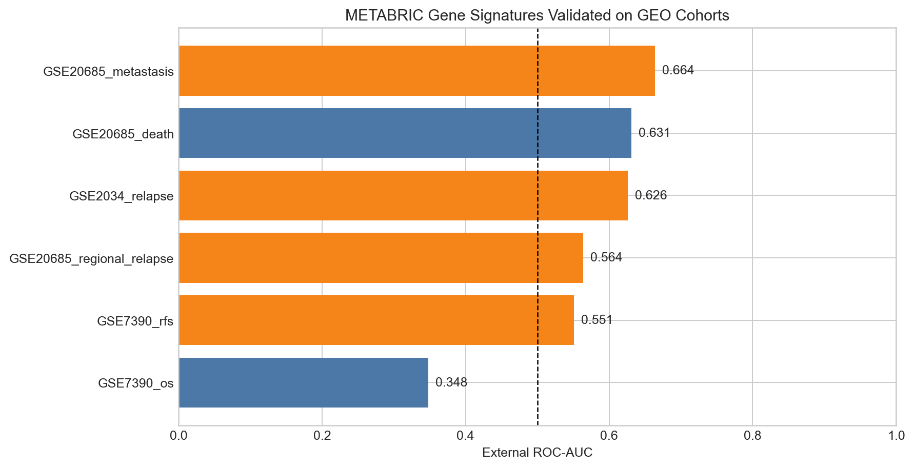

**External ROC Curves**

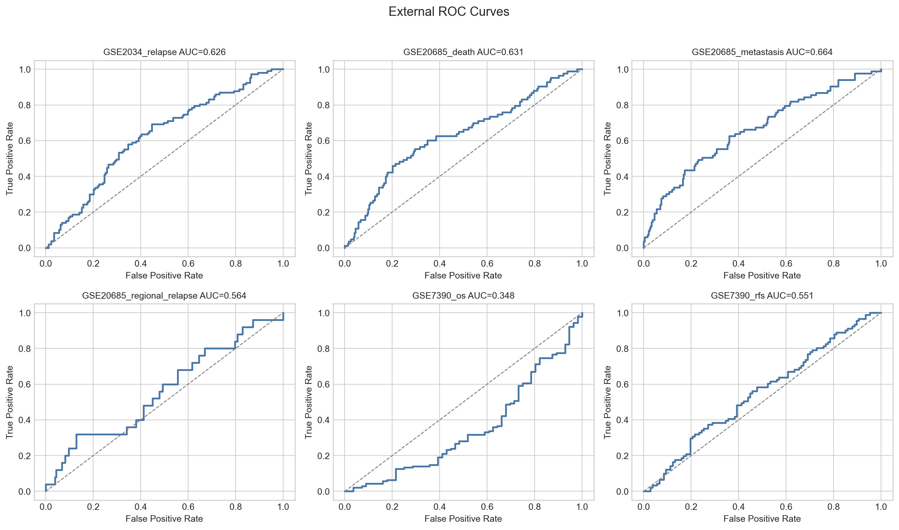

**External Kaplan Meier Risk Groups**

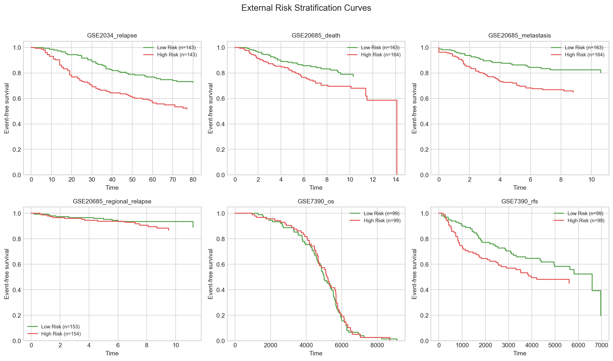

### Gene Correlation and Patterns

- Samples: 1980
- Selected genes: 70
- Plotted genes: 50
- Strong pairs abs(correlation) >= 0.45: 232

Top strong gene-gene relationships:

| gene_a | gene_b | spearman_correlation | abs_correlation | relationship | gene_a_sources | gene_b_sources |
| --- | --- | --- | --- | --- | --- | --- |
| KRT17 | KRT5 | 0.8786776377347074 | 0.8786776377347074 | positive co-expression | curated_breast_cancer_marker; tumor_subtype | curated_breast_cancer_marker; tumor_subtype |
| KRT14 | KRT5 | 0.8313169703488613 | 0.8313169703488613 | positive co-expression | curated_breast_cancer_marker; tumor_subtype | curated_breast_cancer_marker; tumor_subtype |
| KRT17 | KRT14 | 0.8311122787515491 | 0.8311122787515491 | positive co-expression | curated_breast_cancer_marker; tumor_subtype | curated_breast_cancer_marker; tumor_subtype |
| HSD17B6 | COL10A1 | 0.8264913844546761 | 0.8264913844546761 | positive co-expression | cancer_signature | cancer_signature |
| RPL21 | RPL10A | 0.8182115318057174 | 0.8182115318057174 | positive co-expression | survival | survival |
| C1R | CFH | 0.8033241045951958 | 0.8033241045951958 | positive co-expression | survival | survival |
| SDHD | SELENOF | 0.7746489432173993 | 0.7746489432173993 | positive co-expression | survival | survival |
| CLEC10A | KLRB1 | 0.7601745413802427 | 0.7601745413802427 | positive co-expression | tumor_subtype | survival |
| MARCHF6 | FOXP1-IT1 | 0.7425271622354461 | 0.7425271622354461 | positive co-expression | survival | survival |
| MKI67 | CDC20 | 0.7407991263263648 | 0.7407991263263648 | positive co-expression | curated_breast_cancer_marker; recurrence | curated_breast_cancer_marker; recurrence |
| FCN1 | CLEC10A | 0.7407660162196961 | 0.7407660162196961 | positive co-expression | tumor_subtype | tumor_subtype |
| FCN1 | KLRB1 | 0.739634843941349 | 0.739634843941349 | positive co-expression | tumor_subtype | survival |

**Gene-Gene Correlation Heatmap**

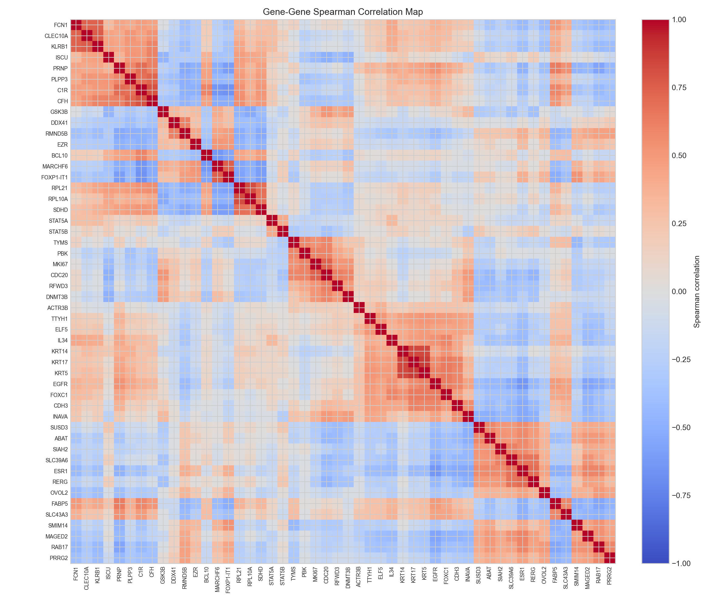

**Subtype Average Gene Expression Pattern**

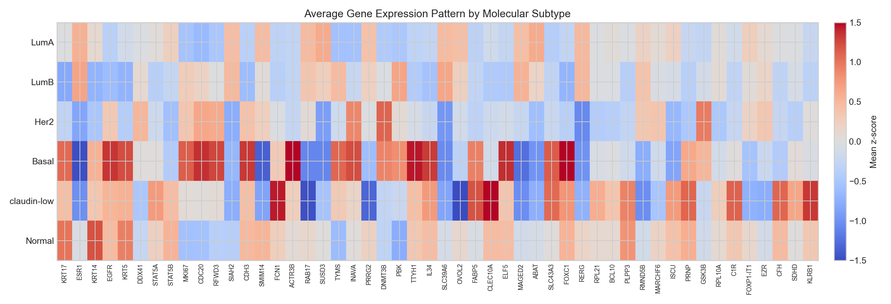

**Strong Gene Correlation Network**

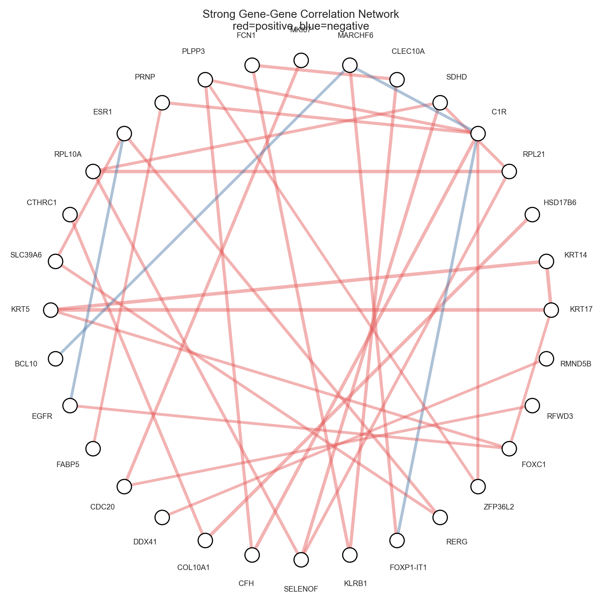

**Gene Pair Scatter Patterns**

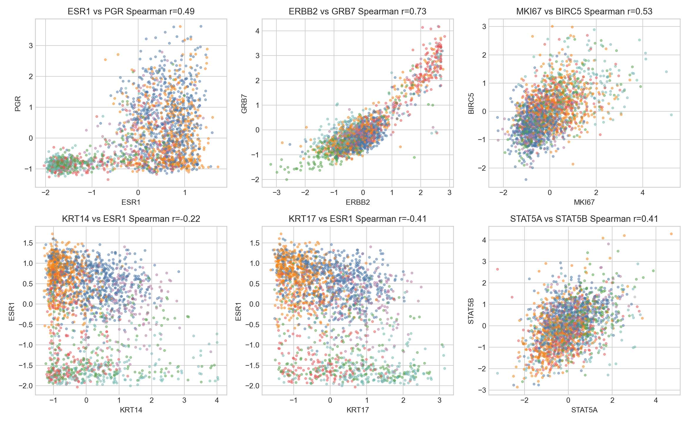

## 5. Deliverables

- Unified notebook: `client_deliverables/breast_cancer_ai_unified_client_notebook.ipynb`
- Streamlit app: `client_deliverables/streamlit_app.py`
- Final report: `client_deliverables/final_client_report.md`
- README: `client_deliverables/README_CLIENT_DELIVERABLES.md`

## 6. Important Scientific Notes

- TCGA part is excellent as Cancer vs Normal molecular signature detection, but it should not be described as future incidence prediction.
- BCSC part is the proper component for percentage future risk, because it has follow-up labels for future diagnosis within one year.
- METABRIC subtype uses real subtype labels, not proxy labels.
- Prognosis models are moderate, which is scientifically normal for recurrence and survival tasks because labels are noisier and biology is more complex.
- GEO external validation is mixed. Some endpoints generalize reasonably, while GSE7390 OS is weak and should be presented as a limitation.
- Clinical support output is for decision support only and must not be framed as a direct treatment prescription.

## 7. Recommended Next Improvements

- Add more external cohorts with recurrence/metastasis/survival labels.
- Add survival-specific methods such as CoxPH, Random Survival Forest, or DeepSurv.
- Add pathway enrichment analysis for top genes.
- Add SHAP plots for the final selected models.
- Prepare a clean manuscript table comparing internal validation and external validation.
